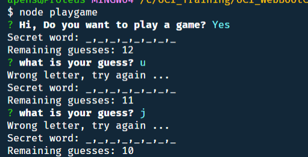
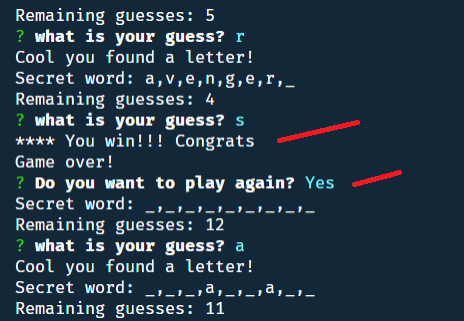
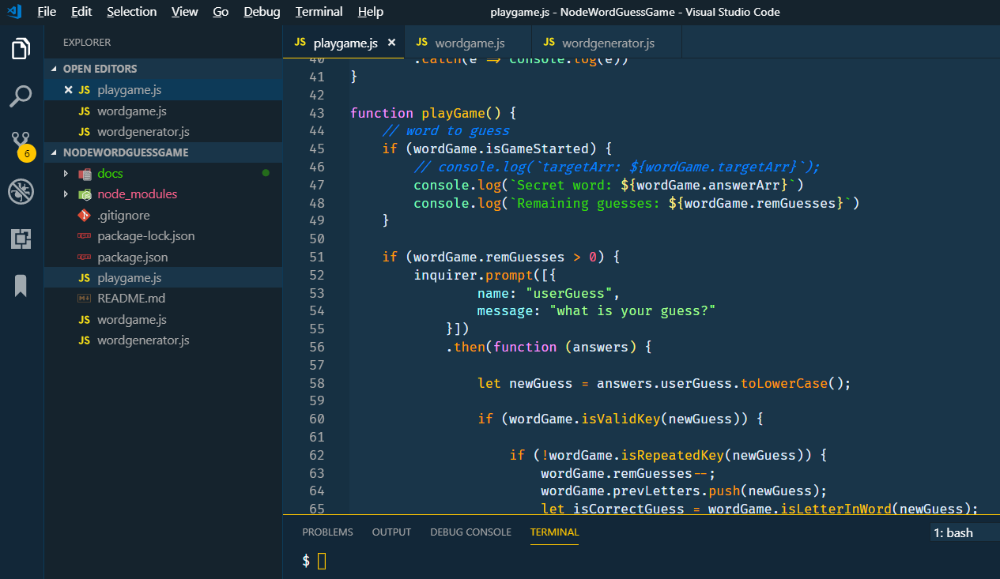

# Word Guess Game (using NodeJS)

_by Armando Pensado_

**Word Guess Game** is a guessing game similar to the Hangman game.

## Description

The game is an application made with NodeJS, and offers a good example integrating several custom modules for an application, which contain functionality encapsulated in objects. 

The game will present the user a secret word, giving a clue about the total letters that composes the word. The user job is to discover each letter in the word. The user will have 12 possible guesses to guess the word.

## How does it work

To start the game, the user needs to execute the following command: 

```js
node playgame.js
```

This command will initiate the game, and the following question will be presented in the terminal:

```js
Hi, Do you want to play a game?
```

 If the user selects “Y”, the application will grab, at random, one of the possible secret words, and the user will be presented with the maximum number of possible guesses, and the opportunity to enter one letter at a time. The game will continue until the word is discovered or the user runs out of guessing opportunities.

The following image depicts the ideas.



If the user discovers the word or runs out of opportunities, the system will  indicate the success or failure, and ask the user for a new game. If the user declines the invitation the application ends.



## Who can benefit from this application

This application is beneficial for NodeJS developer, providing sample programming structures using JavaScript, and the use the **inquirer** external module, and custom-made modules that encapsulate the logic of the game.

## How developers can get started

To start, the developer must have NodeJS installed in the computer. After, that the project can be cloned and initialized.  Here are the steps for getting started.

1. Install NodeJS into the computer  (https://nodejs.org/en/). Download button and run through the installation file.

2. Clone or Fork the project into the computer.

3. In the folder project, Make a `.gitignore` file and add the following lines to it. This will tell git not to track these files, and thus they won't be committed to Github.

```js
node_modules
.DS_Store
```

5. Bring all external module dependencies using the command:


```js
node i
```

After, the initialization, and using Microsoft Visual Code, the project folder should resemble as depicted below, and should be ready for execution.



## Who maintains and contributes to the project

This is a personal project based on UCI Bootcamp training. 

## Where users can get help with the project

The developer can refer to the following links:

* NodeJs  : https://nodejs.org/en/
* Module inquirer: https://www.npmjs.com/package/inquirer
* Express for NodeJS: https://expressjs.com/
* Word Game with Frontend: https://pensadotech.github.io/WordGuessGame/
* Word Game with Frontend repo: https://github.com/pensadotech/WordGuessGame
